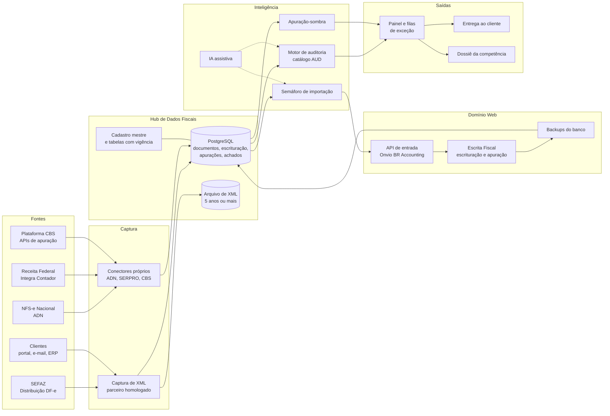

# 01 · Arquitetura do ecossistema

## Princípios

1. **A Domínio continua sendo o livro oficial.** Escrituração, apuração, livros e SPED continuam nela. O ecossistema
   trabalha em volta dela.
2. **Dados antes de robôs.** Primeiro capturar e centralizar os dados. Robô de tela fica só onde não houver porta oficial.
3. **Portas oficiais primeiro.** API da Domínio, Integra Contador, ADN e Distribuição DF-e são mais estáveis do que
   robôs que leem telas, e portais como o e-CAC mudam de tela.
4. **Regras como dados.** Alíquotas, tabelas (CFOP, CST, NCM, monofásicos, ST, anexos do Simples, cClassTrib) e
   parâmetros têm data de início e fim de vigência. A Reforma muda regras todo ano até 2033.
5. **Gestão por exceção.** Cada regra termina em "passou" ou em um achado com dono, prazo e evidência.
6. **Humano no circuito.** A IA sugere, a regra determinística valida e o contador aprova.
7. **Rastreabilidade.** Cada execução e cada achado guardam a regra, a versão, os dados de origem e quem resolveu.

## Visão em camadas

## As três portas da Domínio Web

A Domínio Web **não** é um sistema web nativo. É o programa desktop rodando na nuvem da Thomson Reuters e transmitido
pelo navegador com a tecnologia GraphOn, por meio de um plugin local. Os arquivos entram e saem por unidades mapeadas
(M: é o C: local; Z: são as unidades de rede). Isso define o que dá e o que não dá para automatizar.

| Porta | Mecanismo | Para quê | Situação |
|---|---|---|---|
| **1. Entrada oficial** | **API Onvio BR Accounting** ("Integração com ERP"): lotes de XML (NF-e, NFC-e, NFS-e, CF-e, CT-e, CT-e OS) por empresa. OAuth2 e chave de integração por empresa gerada na Domínio. A Domínio importa por *Importação API* ou por *Rotinas Automáticas* agendadas. | Levar à Escrita Fiscal tudo o que a captura baixar, sem digitação e sem robô | Disponível. Pedir as credenciais em api.dominio@tr.com. Validar custo, limites e se as rotinas rodam sem usuário logado. |
| | **Complementos:** TXT *Importação Padrão* (leiaute Domínio com separador) e *Importador* de Excel (serviços, lançamentos). | Documentos sem XML ou que precisam de classificação explícita | Disponível. Validar se o leiaute aceita acumulador por nota. |
| **2. Saída de dados** | **Backups do banco** (completo aos domingos e de modificações várias vezes por dia) restaurados num servidor próprio com SQL Anywhere e lidos via ODBC por um *usuário externo* somente leitura. | Auditar a escrituração inteira (notas, itens, acumuladores, apurações) com algumas horas de atraso | Usado por fornecedores de BI (Nucont, e-Kontroll). **Confirmar política e licenciamento com a TR.** |
| | **Plano B:** arquivos EFD ICMS/IPI e EFD-Contribuições gerados pela Domínio e relatórios do *Gerador de Relatórios* em Excel. | Mesma finalidade, com mais trabalho manual | Disponível. Serve de teste já na Fase 0. |
| **3. Último recurso** | **Robô de tela** por reconhecimento de imagem, numa VM Windows com resolução fixa. | Cliques repetitivos de alto volume sem alternativa (ex.: gerar EFD em lote) | Frágil: quebra com atualizações, e o login tem MFA. Só com aval da TR e usuário/licença dedicados. |

### Consequência para a escrituração automática

A API envia **o XML bruto**, e a classificação (acumulador, CFOP de entrada) é feita pela *Configuração de Importação*
da Domínio. Ela relaciona acumuladores por CFOP (nas saídas, CFOP + CST de PIS/COFINS) e converte o CFOP na entrada.
Por isso o ecossistema não "lança por fora". Ele faz três coisas:

1. **Padroniza** acumuladores e configurações de importação em todas as empresas, a partir de uma empresa-modelo.
2. **Prevê** se a configuração vai acertar cada documento antes de enviá-lo. É o *semáforo de importação*, descrito
   em [03 · Esteira](03-esteira-de-fechamento.md).
3. **Audita** o resultado depois da importação, com os grupos A, B e C do [catálogo](02-catalogo-auditorias.md).

## Fontes externas (APIs oficiais)

| Fonte | O que traz | Autenticação | Limites e cuidados |
|---|---|---|---|
| **SEFAZ · Distribuição DF-e** (NF-e/CT-e) | Notas em que o cliente é destinatário, transportador ou está no campo autXML. O destinatário recebe só o resumo até registrar a manifestação de *ciência da operação*. | Certificado do cliente (a mesma raiz de CNPJ cobre as filiais) ou do escritório, quando ele está no autXML. | **O emitente não recebe as próprias notas.** Por isso a *campanha autXML*: o cliente põe o CNPJ do escritório nas NF-e que emite. Até 50 documentos por consulta e cerca de 90 dias de disponibilidade. Consulta fora da regra bloqueia o CNPJ por 1 hora (rejeição 656). |
| **NFS-e Nacional · ADN** | NFS-e em que o cliente é prestador, tomador ou intermediário, e eventos, por NSU. | mTLS com certificado ICP-Brasil **do próprio cliente**. Não há modo procurador documentado. | Só traz o que está no ADN, e municípios que ainda não compartilham ficam de fora. Desde 01/11/2026 as ME/EPP do Simples emitem pelo Emissor Nacional. |
| **Receita Federal · Integra Contador (SERPRO)** | PGDAS-D (declarar, gerar DAS, consultas, extrato), DEFIS, DCTFWeb e MIT, Sicalc, Caixa Postal e DTE, relatório de situação fiscal (SITFIS), consulta de pagamentos, parcelamentos, eventos de atualização. | e-CNPJ do escritório (OAuth2 + mTLS) e procuração eletrônica de cada cliente para os códigos de serviço. | Cobrança por consumo em faixas. Referência de set/2026 na 1ª faixa: consulta R$ 0,24, emissão R$ 0,32, declaração R$ 0,40. Conferir na Loja SERPRO. Não baixa arquivos SPED. |
| **Receita Federal · Plataforma CBS** | Apuração assistida: débitos, créditos e pagamentos. | Certificado/procuração (a detalhar). | APIs novas a partir de out/2026, em fase de testes. Efeito financeiro a partir de 2027. |
| **Receita Federal · Conformidade Fácil** | Tabelas de classificação da CBS/IBS (cClassTrib). | Pública. | Carregar como tabela com vigência. |

## Hub de Dados Fiscais

- **Banco PostgreSQL** com:
  - empresas (cadastro mestre) e participantes;
  - documentos (cabeçalho, itens, tributos, eventos);
  - escrituração extraída da Domínio;
  - apurações (Domínio e sombra);
  - declarações e recibos, guias e pagamentos;
  - **achados de auditoria** (regra, versão, evidência, status, responsável, prazo);
  - execuções (log);
  - tabelas de referência com vigência.
- **Arquivo imutável dos XML originais** por no mínimo 5 anos, mais o tempo de eventuais discussões.
- **Cargas idempotentes:** reprocessar um lote nunca duplica dados.

## Inteligência

- **Motor de auditoria.** Cada regra do [catálogo](02-catalogo-auditorias.md) vira um teste com:
  - entrada (dados do hub);
  - tolerância;
  - severidade;
  - ação: *bloqueia* o fechamento, *alerta* ou gera *oportunidade*.
- **Apuração-sombra.** Recálculo independente de:
  - Simples: RBT12, anexo, fator R, segregações de ST, monofásico e exportação;
  - Presumido: presunção por atividade, acréscimo da LC 224/2025 e adicional;
  - ICMS: C190 × E110;
  - retenções.
- **Semáforo de importação.** Prevê, pelo histórico do fornecedor e do produto, se a configuração da Domínio vai
  classificar certo.
- **IA assistiva (Claude).** Tarefas:
  - classificar a finalidade do item pela descrição (revenda, insumo, uso e consumo, ativo);
  - extrair dados de PDF sem XML;
  - explicar divergências em linguagem simples;
  - resumir a Caixa Postal.

  A IA nunca decide sozinha, e dados pessoais são mascarados.

## Orquestração e saídas

- **Agendador** (Prefect ou n8n) roda a esteira por empresa × competência e registra cada execução.
- **Tarefas:**
  - usar o **Domínio Processos** se estiver no pacote contratado. A TR comprou a Gestta em 2022, e a integração
    fecha tarefas automaticamente.
  - Se não estiver, usar a ferramenta atual do escritório.
- **Painel** (Power BI, Looker Studio ou Metabase) com:
  - status do fechamento;
  - achados por severidade e por analista;
  - KPIs do projeto.
- **Entrega ao cliente** por Portal do Cliente, Domínio Messenger, e-mail ou WhatsApp, com resumo do mês:
  tributos, variação e vencimentos.

## Comprar × construir

| Bloco | Recomendação | Por quê |
|---|---|---|
| Captura de NF-e/CT-e/NFS-e | **Comprar** um parceiro homologado da API Domínio (ex.: SIEG, Qive, Jettax, Fiscal.io) | Commodity. Exige gestão de certificados, limites da SEFAZ e NFS-e de municípios fora do ADN. Exigir exportação para o hub. |
| NFS-e do ADN | Construir, se o parceiro não cobrir bem | API simples, por NSU, com o certificado do cliente. |
| Auditoria XML × SPED | **POC** do Kolossus Auditor (add-on da TR) e de 1 alternativa (ex.: e-Auditoria) | Pode cobrir boa parte dos grupos A–C sem desenvolvimento. O catálogo serve de checklist de cobertura. |
| Apuração automatizada do Simples | Avaliar ferramenta (ex.: Sittax) × apuração-sombra própria | Depende do volume de clientes no Simples. |
| Receita Federal | **Construir** sobre o Integra Contador | API oficial, barata, e o escritório controla os dados. |
| Hub, regras próprias, semáforo, painel | **Construir** | É o diferencial do escritório e o que amarra tudo. |
| Workflow de tarefas | **Usar** o Domínio Processos ou a ferramenta atual | Não vale construir. |

> Não adotar a Nuvem Fiscal: o serviço foi encerrado em 31/07/2026.

## Stack sugerida

- **Python 3.12** (pandas/polars, lxml, httpx com mTLS), **PostgreSQL 16**, **Prefect ou n8n**, **Power BI / Looker
  Studio / Metabase**, **Git** (este repositório) e **Claude Code** para desenvolver e manter as regras.
- **Servidor:** uma VM Windows (SQL Anywhere/ODBC e, se preciso, robô) mais o restante em Linux ou containers. Para
  começar, uma única VM basta.
- **Cofre de segredos** para certificados A1, senhas e chaves de API. Nunca em e-mail nem em pasta compartilhada.
