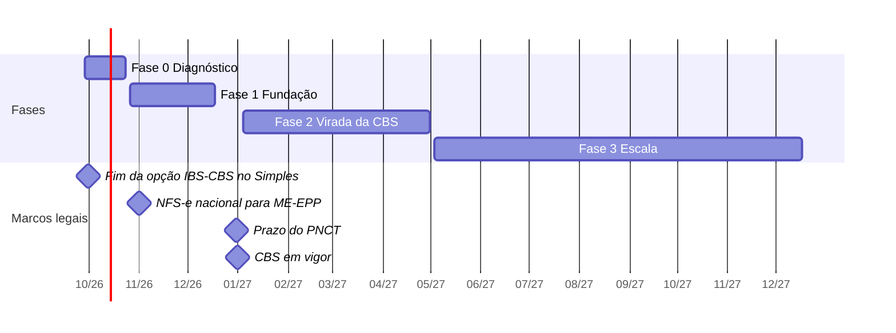

# 04 · Roadmap

Cada fase termina com um **go/no-go**: só se avança (e só se aumentam custos) quando os critérios de saída
forem atingidos.

## Fase 0 · Diagnóstico e decisões (28/09 a 23/10/2026)

**Objetivo:** medir o ponto de partida e decidir o caminho.

**Entregáveis**

- Baseline: horas por etapa, por empresa e por classe ([kit da Fase 0](../fase0/Kit_Fase0_Diagnostico.xlsx)).
- Cadastro mestre de 100% das empresas.
- Inventário de certificados, procurações e acessos.
- Respostas da Thomson Reuters e do SERPRO ao roteiro.
- POCs de captura e de auditoria, avaliadas com o catálogo.
- 15 a 20 empresas-piloto, misturando as classes A, B e C.
- Decisões, orçamento e ambiente preparado.

**Critério de saída**

- Baseline aprovado.
- Portas da Domínio definidas: API de entrada ativa e forma de extração escolhida (backup ou EFD/relatórios).
- Orçamento da Fase 1 aprovado.

**Ganho esperado:** nenhum. A medição custa cerca de 5% do tempo da equipe por duas semanas.

## Fase 1 · Fundação e ganhos rápidos (26/10 a 18/12/2026)

**Objetivo:** dados fluindo e as 16 primeiras regras rodando, primeiro no piloto e depois em todas as empresas.

**Entregáveis**

- Captura em produção (parceiro homologado + ADN) e campanha autXML.
- Hub v1 em PostgreSQL com cargas idempotentes.
- Extração da escrituração da Domínio.
- As 16 regras da Fase 1 ([catálogo](02-catalogo-auditorias.md)), incluindo IBS/CBS nos documentos (AUD-C11) antes do
  prazo do PNCT.
- Integra Contador: consultas do PGDAS-D, extrato e Caixa Postal.
- Painel v1: fila de exceções por analista e status do fechamento.

**Ritmo**

- Novembro: piloto em modo sombra.
- Dezembro: todas as empresas.

**Critério de saída**

- 90% ou mais dos documentos do piloto capturados automaticamente.
- Falsos positivos abaixo de 20% nas regras da Fase 1.
- Horas por empresa do piloto 10% abaixo do baseline.
- Equipe trabalhando pela fila de exceções.

**Ganho acumulado esperado:** cerca de 10% (coleta e conferência).

## Fase 2 · Virada da CBS e escrituração assistida (janeiro a abril/2027)

**Objetivo:**

- entrada automática pela API com semáforo;
- apuração-sombra;
- cruzamento declarado × apurado × pago;
- controles da CBS.

**Entregáveis**

- Semáforo de importação v1, envio pela API e Rotinas Automáticas.
- Acumuladores padronizados a partir de uma empresa-modelo.
- As 16 regras da Fase 2, entre elas:
  - fator R (D03), Lucro Presumido com LC 224/2025 (D04), ICMS (D06);
  - retenções (D08) e dividendos (D10);
  - declarado × pago (E01 a E03);
  - apuração assistida da CBS (E05).
- Entrega automática do pacote ao cliente.
- Domínio Processos integrado, se contratado.

**Atenção ao calendário**

- Janeiro concentra a virada da CBS e o fechamento anual. Não implantar mudanças grandes de processo nesse mês.
- De março a maio há o IRPF, se o fiscal ajudar nele.

**Critério de saída**

- 60% dos documentos em verde.
- 80% das empresas fechadas até D+10.
- Horas por empresa 20% abaixo do baseline.

**Ganho acumulado esperado:** cerca de 20%.

## Fase 3 · Escala e inteligência (maio a dezembro/2027)

**Objetivo:** regras complexas, IA assistiva, analítica e reorganização em células.

**Entregáveis**

- As 13 regras da Fase 3: ST, PIS/COFINS não cumulativo (revisão retroativa), IPI, NCM, antecipação, parcelamentos
  e analítica.
- IA assistiva: finalidade do item, leitura de PDF sem XML e explicação de divergências.
- Robô de tela pontual, se a TR autorizar e houver volume.
- Células de trabalho e dossiê automático.

**Critério de saída**

- 80% dos documentos em verde.
- Horas por empresa 28% abaixo do baseline (cenário base).
- Erros depois da entrega 80% menores.

**Ganho acumulado esperado:** cerca de 28% no cenário base.

## Fase 4 · Expansão (2028 em diante)

- **Contábil:** fiscal × contábil (G03) e conciliações.
- **DP:** folha para o fator R e EFD-Reinf.
- **Transição ICMS/ISS → IBS (2029–2032):** tabelas com vigência e dupla apuração.
- **Planejamento tributário com os dados do hub:** simulação anual de regime por cliente e impacto da Reforma. É um
  serviço novo que o escritório passa a poder vender.
